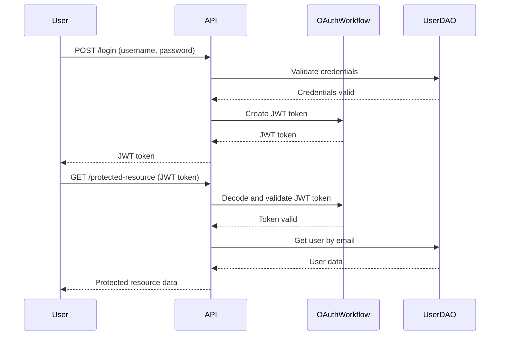

# URL Shortener Project Architecture

This document provides a comprehensive overview of the URL Shortener project's architecture, components, and key flows.

## System Overview

The URL Shortener is a web application built with FastAPI, SQLAlchemy, and Pydantic. It allows users to create shortened URLs, retrieve original URLs, and manage their accounts.

## Architecture Components

1. **API Layer**: FastAPI routes for handling HTTP requests
2. **Workflow Layer**: Implementation of business logic
3. **DAO (Data Access Object) Layer**: Handles database operations
4. **Model Layer**: SQLAlchemy ORM models
5. **Schema Layer**: Pydantic models for request/response validation
6. **Utility Layer**: Helper functions and configurations
7. **Database**: SQLite database (easily switchable to other SQL databases)

## Detailed Architecture Diagram
